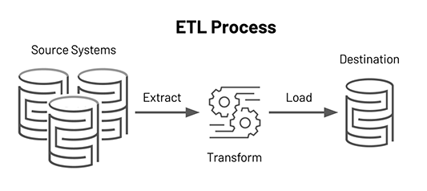

# San Francisco Fire Calls ETL and Analysis

#### SUMMARY

Fire Calls-For-Service includes all fire units' responses to 911 calls from the city's Computer-Aided Dispatch (“CAD”) system. This includes responses to Medical Incidents requiring EMS staff. Each record includes the call number, incident number, address, unit identifier, call type, and disposition. All relevant time intervals are also included. Because this dataset is based on responses, and since most calls involve multiple units, there are multiple records for each call number. Addresses are associated with an intersection or call box, not a specific address.

#### HOW TO USE THIS DATASET

This dataset is based on responses, and since most calls involve multiple units, there are multiple records for each call number. The most common call types are Medical Incidents, Alarms, Structure Fires, and Traffic Collisions.

* This pipeline uses the San Francisco Fire Department's call event dataset and demonstrates:
    * *End-to-end Data Engineering pipeline covers the extraction, transformation and loading (ETL) steps of large volumes of data, using PySpark for transformation and Spark SQL for queries. Caching techniques were implemented to optimize query performance, and data analysis was conducted to gain insights.* 
    * *How to answer questions by analizing data using Spark SQL*

* This project involved:

🔹 *Data Ingestion: Reading emergency call data from the San Francisco Fire Department stored in Amazon S3.*
🔹 *Secure Storage: Transferring and storing the data in Azure Data Lake Storage (ADLS).*
🔹 *Transformation and Analysis: Using Azure Databricks to transform, analyze, and store the transformed data.*
